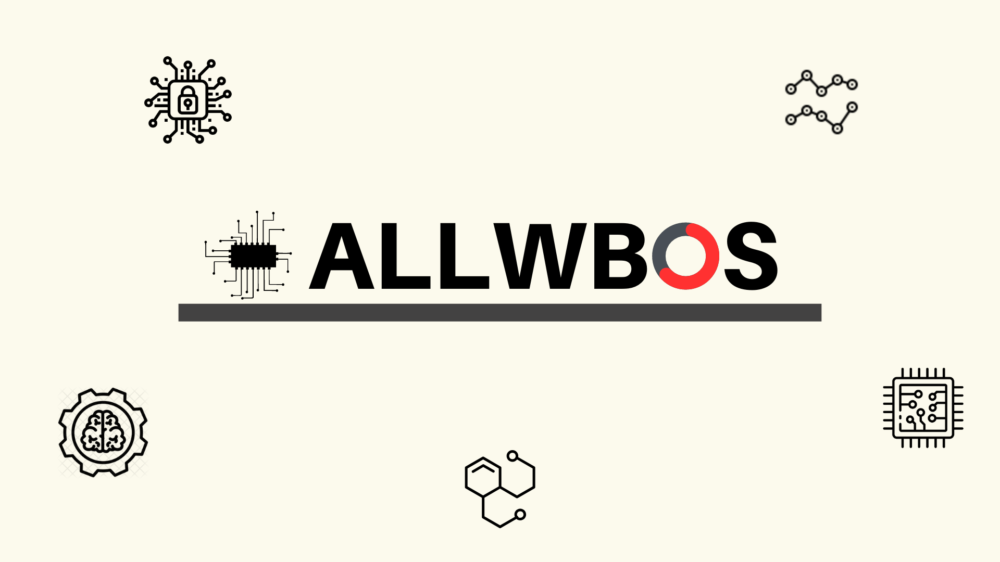
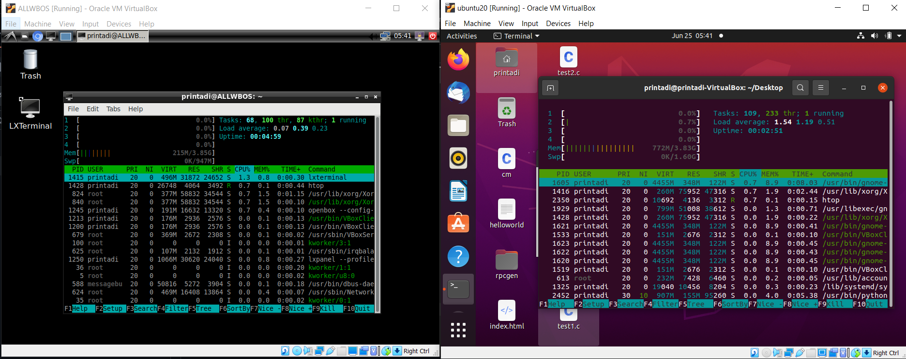

<h1>ALLWBOS - Light Linux Work Bench Operating System.</h1>

  

Here we're committed for the development of a Linux based operating system extended from Ubuntu distro from debian OS.

Our foremost objective of this development is to design and build super lightweight OS which can perform nearly all operations of UBUNTU but with a significantly low computations & consumption of RAM. The amount of RAM and CPU consumptions can lowered upto 4X [4-TIMES] as a result users will have a seemless workflow even on machines which have limited resources for execution of tasks but users will get all the features of ubuntu out of the box.

This <b>OS has 2 variants</b> out of which <b>one[allwbos0.1_loaded.iso]</b> comes with pre-bundled apps/packages specifically targeted for Computer Science profile. like pre-installed Atom, VScode, Hadoop, JupyterNotebook , Python 3, Python 2, JAVA, C++/C, VMD[Molecular Analysis]. In the next updates we will be adding more Computer Science targeted features for the better use case of this OS for CS Students/Professors.

<b>Another variant is [allwbos_base0.1.iso]</b>.It is the Base Operating System which will be having all the basic utility applications which you'll also find in fresh install of ubuntu but it will not be having any pre-bundled apps/packages like VScode , Hadoop etc as mentioned above. This variant will be more suited for those users who want absolute minimal experience of this OS and can install all the neccessary tools on their own like JAVA , Python etc.

<H1>DOWNLOADS:</H1>
<ul>
<li><a href="https://drive.google.com/file/d/1s2Kuk9KQPJgXiRS1lKJpvdDQZgT5dljk/view?usp=drive_link">allwbos_base0.1.iso</a></li>
<li><a href="https://drive.google.com/file/d/1dbk71AdUDY59BdkdJVbGXUO-D-06qfdp/view?usp=drive_link">allwbos0.1_loaded.iso</a></li>
<li><a href="https://drive.google.com/file/d/1MjHciw0x9TAL11zBAFUvT8OWqenLSbEL/view?usp=drive_link">VBox_Guest_Additions_6.1</a> (optional)</li>
</ul>
<h3 align="center">Difference in resource consumption</h3>

ALLWBOS is using 215mb of memory & Ubuntu 20.04LTS using 772mb of memory

<h1>How to install ?</h1>

Tutorial to install LOADED VERSION [allwbos0.1_loaded.iso]

https://www.youtube.com/NhO3rRVyhrU
 
 

Tutorial to install BASE VERSION [allwbos_base0.1.iso]

https://youtu.be/NhO3rRVyhrU

<H1 align="center">THE END!!💻📀</H1>
